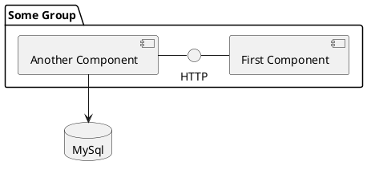
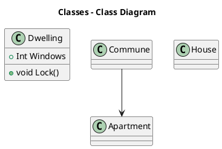

Hi, this time I would like to share with my recent finding - [PlantUml](http://plantuml.com)

# PlantUml

PlantUml is an markup language designed to draw UML diagrams. 
Just look on example: 



Would be rendered as: 


In case of simple class diagrams it could be also rendered as ascii text:



ascii: 

```
,------------.                     
|Dwelling    |  ,-------.   ,-----.
|------------|  |Commune|   |House|
|+Int Windows|  |-------|   |-----|
|------------|  |-------|   |-----|
|+void Lock()|  `-------'   `-----'
`------------'       |             
                     |             
                     |             
               ,---------.         
               |Apartment|         
               |---------|         
               |---------|         
               `---------'         
```


# Use with Markdown

If you like to insert your new shiny uml diagram have inserted into Markdown page, you have to options: 

Render the image, upload to your graphic assets directory and simple link it: 

```

```

However above method would obviously work, but is not especially efficent. When you like to change anything in the diagram to make it updated, it would
be necessary to render image and upload it again. 
Other option is to use [planttext.com](http:planttext.com) online editing tool instead, it gives you possibility to encode your uml into url like:

```

```


# Use with Gists


# Place in GitHub Readme.md

# Resources

* [plantuml.com](http://plantuml.com/) - main page, all you need to know about PlantUml
* [this blog](https://rdmueller.github.io/plantuml-gradle/) - some interesting articles and tricks 
* [planttext.com](planttext.com) - plantuml online editor
* [PlantUml Gits](http://uml.mvnsearch.org) - renders plantuml from github 
