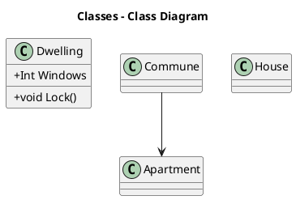

Hi, this time I would like to share with my recent finding - [PlantUml](http://plantuml.com). I going to describe shortly how to use PlantUml on your blog posts or github wiki pages.
I believe that in some particular cases, this tool, could be good alternative for [draw.io](http://draw.io).

# PlantUml

PlantUml is an markup language designed to draw UML diagrams. 
Just look on example: 

```plantuml

@startuml


package "Some Group" {
 HTTP - [First Component]
 [Another Component]
}

database "MySql" {
 
}


[Another Component] - HTTP
[Another Component] --> MySql


@enduml
```

Would be rendered as: 


In case of simple class diagrams it could be also rendered as ascii text:



ascii: 

```
,------------.                     
|Dwelling    |  ,-------.   ,-----.
|------------|  |Commune|   |House|
|+Int Windows|  |-------|   |-----|
|------------|  |-------|   |-----|
|+void Lock()|  `-------'   `-----'
`------------'       |             
                    |             
                    |             
              ,---------.         
              |Apartment|         
              |---------|         
              |---------|         
              `---------'         
```


# Use with Markdown

If you like to insert your new shiny uml diagram have inserted into Markdown page, you have to options: 

Render the image, upload to your graphic assets directory and simple link it: 

```

```

However above method would obviously work, but is not especially efficient. When you like to change anything in the diagram to make it updated, it would
be necessary to render image and upload it again. 
Other option is to use [planttext.com](http:planttext.com) online editing tool instead, it gives you possibility to encode your uml into url like:

```

```

Above method uses url encoding described as 'special', here it is why:

1. First step is to encode plantUml sources into utf-8
2. Compression with [Deflate](http://en.wikipedia.org/wiki/DEFLATE) algorithm
3. Encode back into plain ASCII with something like Base64 

Have you noticed? "Something like..." what does it mean, they really used _close to_, [look](http://plantuml.com/pte) for yourself? - Unfortunately anything and nothing. 

In result it's impossible to use common online tools to achieve above encoding. You need to use PlantUml tool:

```bash
java -jar plantuml.jar -encodeurl yourdiagram
```

But don't worry it's planttext.com is working pretty stable for your small projects. If you like to setup it for your environment you can use Docker [image](https://hub.docker.com/r/plantuml/plantuml-server/) to serve your own plant-uml server. 


# Use with Gists

With [uml.mvnsearch.org](http://uml.mvnsearch.org) service you can point to your gist identificator, and in response you would get an uml png. 

```

```

results with:

 

# Place in GitHub Readme.md

In case of Github Readme.md files the best solution seams to be with use of planttext.com method or to use uml.mvnsearch.com service. 

Interesting thing with _mvnsearch_ is that it would make you able to point to your _puml_ file directly from your _markdown_ text. 

```

```

I like this method, because I can just edit my _puml_ file and just forget it - It's going to automatically keep my documentation up to date. 

# Summary

So If you are fun of using text based markup languages instead of buffy GUI tools, you can pretty fast write your uml definition and attach it to your markdown or asciidoc files, without huge investment. 

Since now, you would probably find such uml diagrams made with plantUML on my blog more often. 

# Resources

* [plantuml.com](http://plantuml.com/) - main page, all you need to know about PlantUml
* [this blog](https://rdmueller.github.io/plantuml-gradle/) - some interesting articles and tricks 
* [planttext.com](planttext.com) - plantuml online editor
* [PlantUml Gits](http://uml.mvnsearch.org) - renders plantuml from github and gists
* [Example usage](https://raw.githubusercontent.com/sratatata/space-invaders/master/README.md)

